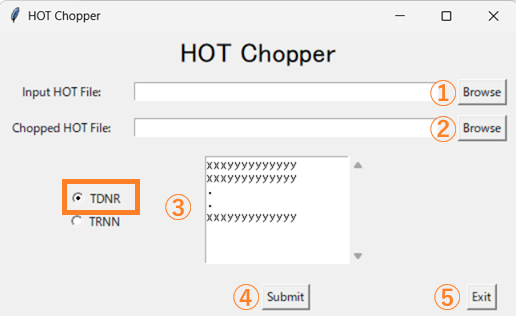
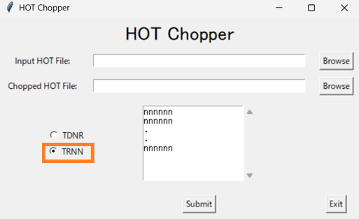

# hotchopper
## Version 1.0

HOTchopper is a tool for the extraction of BSP HOT files with the criteria of 
the TDNR (Ticket Document Number) or the TRNN (Transaction Number).
With the extracted transactions, HOTchopper recalculates all total records (BOT93, BOT94, BCT95 and BFT99) 
based on the rule defined in IATA DISH(data interchange sepcifications handbook), 
so that the output file can be used directly by revenue accounting systems conforming to the IATA DISH.
file:///C:/workplace/hotchop/testdata/bsp-dish-rev22-2016.pdf

## ✅ Key features

- A Graphical user interface (GUI) is available for setting the argument (input file, output file and chop criteria)
- As another option, the command-line interface (CLI) can be used to provide the same functionality as the GUI.
- Automatic identification of line break code from the initial 1000 characters of the HOT file.
- HOT file is compatible with IATA dish 22.0 or later
- In order to avoid any potential conflict with the original file, both TIME and FSQN in BFH01 are set at random.

## 🔧 HOTchopper requires the poetry to be developed and processed.

Install dependencies with Poetry:

```bash
poetry install
poetry run python -m md2pt_jp.cli ...
```

### 💡 about tkinter

This GUI application uses the Python standard library `tkinter`.
Installation is usually not required on Windows/macOS, but if you want to use it on Linux or Docker, the following is required:

[Ubuntu]
sudo apt install python3-tk


## 🚀 How to use GUI

```bash
poetry run python gui.py
```

- ① The input file selection dialogue is displayed.
- ② The output file selection dialogue is displayed.
- ③ The criteria input box contains the default characters.
- ④ Start processing HOT chopper
- ⑤ Exit button



## 🚀 How to use CLI

### There 5 arArguments
```bash
poetry run python -m hotchop.cli input_path output_path chop_criteria --criteria_type TDNR --overwrite --log
```
### HOT chop by the TDNR criteria(Please note that TDNR is the default criteria type and can be abbreviated.)
```bash
poetry run python -m hotchop.cli testdata/Input.txt testdata/output.txt 9992423207406,9992423239061 --criteria_type TDNR --overwrite --log
poetry run python -m hotchop.cli testdata/Input.txt testdata/output.txt 9992423207406,9992423239061 --overwrite --log
```
### HOT chop by the TRNN criteria
```bash
poetry run python -m hotchop.cli testdata/Input.txt testdata/output.txt 1,2,3 --criteria_type TRNN --overwrite --log
```
### If you want to overwrite an existing .txt file
・By default, if there is a .txt file with the same name in the output destination, processing is aborted.
・If --overwrite is specified, existing files are forcibly overwritten.
```bash
poetry run python -m hotchop.cli testdata/Input.txt testdata/output.txt 1,2,3 --criteria_type TRNN --overwrite
```
### To output a log file
・--log will output INFO / ERROR log to hotchop.log file
```bash
poetry run python -m hotchop.cli testdata/Input.txt testdata/output.txt 1,2,3 --criteria_type TRNN --overwrite --log
```